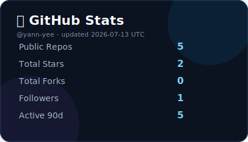
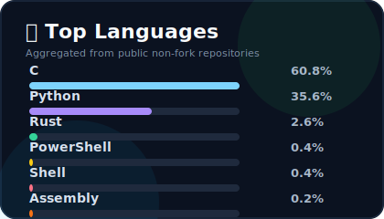

  

# 👋 Hi, I’m **yann yee**
*嵌入式开发 | 嵌入式AI | 模型推理 on Low-Cost Hardware*

🚀 我主要从事 **STM32**、**ESP32** 和 **Linux 嵌入式系统** 开发，并致力于在低成本硬件上实现 **AI 模型推理（微调、强化学习、CNN）**。

---

## 🛠 技术栈

---

## 📌 Featured Repositories

<!-- FEATURED_REPOS_START -->
- **[icon-creator](https://github.com/yann-yee/icon-creator)** `Rust` · ⭐ 1 · 最近提交 `2026-06-07`  
  No description yet.
- **[mcu-bridge](https://github.com/yann-yee/mcu-bridge)** `C` · ⭐ 1 · 最近提交 `2026-06-06`  
  No description yet.
- **[yolo](https://github.com/yann-yee/yolo)** `Python` · ⭐ 0 · 最近提交 `2026-06-12`  
  copy ultralytics and add my code
- **[my-wezterm](https://github.com/yann-yee/my-wezterm)** `PowerShell` · ⭐ 0 · 最近提交 `2026-05-14`  
  我的wezterm终端配置
<!-- FEATURED_REPOS_END -->

---

## 📊 GitHub Stats

  
  

---

## 📫 联系我
📌 GitHub: [yann-yee](https://github.com/yann-yee)  
✉️ Email: *yyds2606969228@gmail.com*  

> “学无止境，代码即艺术。” 🎯
